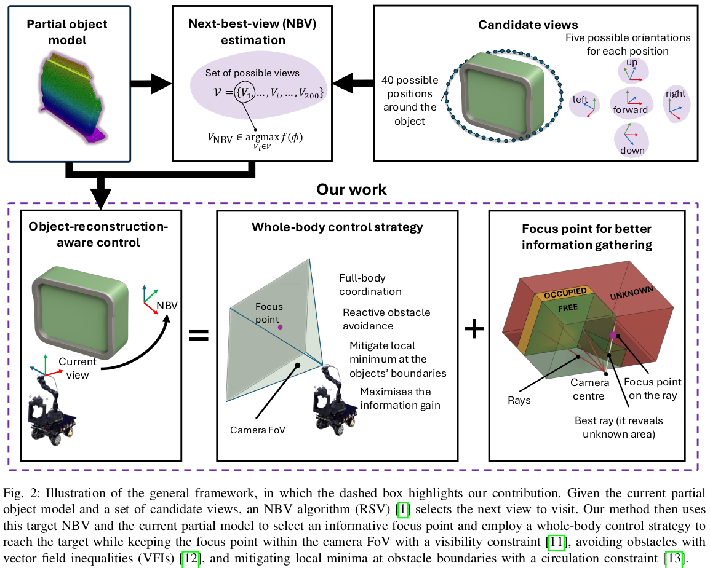
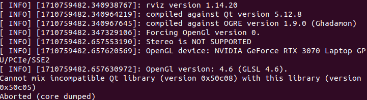
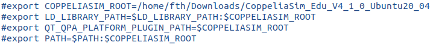

<div align="center">

# Object-Reconstruction-Aware Whole-body Control of Mobile Manipulators
Fatih Dursun, Bruno Vilhena Adorno, Simon Watson, Wei Pan

Manchester Centre for Robotics
and AI, University of Manchester,
</div>

<div align="center">

[](https://arxiv.org/pdf/2509.04094)
[](LICENSE)
[](http://wiki.ros.org/noetic)
[](https://www.python.org/)
[](https://github.com/stepjam/PyRep)

</div>

# 📜 Introduction

Object reconstruction and inspection tasks play a crucial role in various robotics applications. Identifying paths that reveal the most unknown areas of the object becomes paramount in this context, as it directly affects efficiency, and this problem is known as the view path planning problem. Current methods often use sampling-based path planning techniques, evaluating potential views along the path to enhance reconstruction performance. However, these methods are computationally expensive as they require evaluating several candidate views on the path. To this end, we propose a computationally efficient solution that relies on calculating a focus point in the most informative (unknown) region and having the robot maintain this point in the camera field of view along the path. We incorporated this strategy into the whole-body
control of a mobile manipulator employing a visibility constraint without the need for an additional path planner. We conducted comprehensive and realistic simulations using a large dataset of 114 diverse objects of varying sizes from 57 categories to compare our method with a  ampling-based planning strategy using Bayesian data analysis. Furthermore, we performed real-world experiments with an 8-DoF mobile manipulator to demonstrate the proposed method’s performance in practice. Our results suggest that there is no significant difference in object coverage and entropy. In contrast, our method is approximately nine times faster than the baseline sampling-based method in terms of the
average time the robot spends between views.


## 🔧 Installation

### Prerequisites
- **Ubuntu 20.04** with ROS Noetic
- **Python 3.8** (recommend Conda environment)
- **Pyrep** ([Rep](https://github.com/stepjam/PyRep/tree/8f420be8064b1970aae18a9cfbc978dfb15747ef))
- **dqrobotics** ([DQ](https://dqrobotics.github.io))
- **octomap** ([Octomap](https://octomap.github.io))

### Build from Source
```bash
# Create workspace
mkdir -p ~/orac_ws/src
cd ~/orac_ws/src

# Clone repository
git clone https://github.com/fthdrsn/NBV_object_recontruction.git .

# Build ROS packages
cd ~/orac_ws
catkin build

# Source workspace
source devel/setup.bash
```

## 🚀 Quick Start

### 1. Prepare Data
The ground-truth point clouds and their corresponding poses are shared in the **orac_main_python/dataset** folder. The file **ORAC_data/GtPclData/object_list.txt** contains the list of the 114 objects from the ShapeNet dataset that were used in our simulations. The mesh files corresponding to these objects should be downloaded from the ShapeNet dataset (https://huggingface.co/datasets/ShapeNet/ShapeNetCore) and placed in the **ORAC_data/MeshData** directory.


Configure paths in `orac_main_python/Config/config.yaml`:
```yaml
DataPaths:
  dataRootPath: "/path/to/your/ORAC_data"
  meshDataPath: "/path/to/your/ORAC_data/MeshData"
  gtPclPath: "/path/to/your/ORAC_data/GtPclData"
  objectList: "/path/to/your/ORAC_data/GtPclData/object_list.txt"
  candiateViewsPath: "/path/to/your/ORAC_data/candidate_views_200.txt"
  resultSavePath: "/path/to/your/ORAC_result/Results"
```

### 2. Run Reconstruction

**Terminal 1: Start ROS Core**
```bash
roscore
```

**Terminal 2: Run main.py**
```bash
conda activate your_env
cd ~/orac_ws/src/orac_main_python
source ../../orac_ws/devel/setup.bash
python3 main.py
```

It will initiate simulation and start reconstruction process for 114 objects using 3 different strategy.

**FOCUS**: Our proposed method, which computes a focus point in an informative region and keeps this point within the camera field of view (FoV) while the robot moves toward the NBV.

**SAMPLING**: A baseline sampling-based approach in which intermediate views are sampled and evaluated as the robot moves toward the NBV. Consequently, the robot visits intermediate views along the path.

**NOPATH**: A baseline approach in which the robot moves directly to the NBV without maintaining a focus point within the camera FoV and without sampling intermediate views.
### 3. Results

The structure of result folder will be:
```
results/
├── {object_name}/
│   ├── FOCUS/
│   │   ├── nbv_0.json         # Initial state
│   │   ├── nbv_1.json         # After 1st NBV
│   │   ├── ...
│   │   ├── summary.json       # Aggregated metrics
│   │   ├── pcl_data/          # Partial point clouds
│   │   └── octomap_data/      # OctoMap files 
│   ├── SAMPLING/
│   └── NOPATH/
```
### 🏗️ Package Structure
```
orac_ws/
├── orac_main_python/              # Python main package
│   ├── main.py                    # Main code
│   ├── RobotModel/                # Kinematics & robot interface
│   ├── RobotController/           # QP controller
│   ├── SamplingBasedIPP/          # A sampling based baseline implementation
│   ├── Utils/                     # Data management & visualization & helper funcions
│   └── Config/                    # Configuration file and CoppeliaSim scene file
│
├── orac_octomap_operations/       # C++ ROS package
│   ├── src/                       # Information gain&focus point&ray-casting
│   ├── include/                   # Header files
│   ├── launch/                    # Launch files
│   └── config/                    # Ray casting and octomap related parameters
│
└── orac_reconstruction_services/  # ROS service definitions
    └── srv/                       # Service message files
```
## ⚙️ Configuration
There are two configurations files: **orac_main_python/Config/config.yaml** which sets parameter related to robot control, simulation and data paths etc.; **orac_octomap_operations/config/octomap_ops_params.yaml** which handles the parameters related to octomap, ray casting and information gain calculation.

### 🔎 Changing Camera Parameters
**orac_main_python/Config/config.yaml:**
```yaml
CameraParameters: 
  imWidth: 640
  imHeight: 480
  camFov: 74  
  nearClip: 0.01
  farClip: 5.0
```
Changing the parameters in this file automatically updates the properties of the CoppeliaSim vision sensor. The same camera parameters should also be set for the ray-casting process in **orac_octomap_operations/config/octomap_ops_params.yaml**
```yaml
camera/horizontal_fov: 74 
camera/vertical_fov: 60 
raycast/r_max: 4.5 #It should be less than farClip distance.
```
### 🔎 Changing Octomap Resolution for Ray-Casting
You can use a lower-resolution OctoMap for ray casting. First, enable the creation of a second OctoMap with a coarse resolution (coarse_res) using **orac_octomap_operations/launch/run_application.launch:**
```launch
<arg name="use_low_res" default="true" doc="Use coarse octomap (starts dual octomap servers)"/>
<arg name="fine_res" default="0.03"/>
<arg name="coarse_res" default="0.12"/>
```
Next: **orac_octomap_operations/config/octomap_ops_params.yaml:**
```yaml
raycast/use_low_res_octomap: true ## Apply ray casting using coarse octomap.
octomap/cell_size: 0.03  ## Resolution of the octomap
octomap/low_res_cell_size: 0.12  ## Resolution of the low resolution octomap (if using coarse octomap)
```
It is very important to match the OctoMap parameters in the launch file and the configuration file.

## 📝 Citation

If you use this work in your research, please cite:

```bibtex
@article{dursun2025,
author = {Dursun, Fatih and Adorno, Bruno and Watson, Simon and Pan, Wei},
year = {2025},
month = {09},
pages = {},
title = {Object-Reconstruction-Aware Whole-body Control of Mobile Manipulators},
doi = {10.48550/arXiv.2509.04094}
}
```

## 🙏 Acknowledgments

This project builds upon several libraries and dataset:
- **[DQ Robotics](https://dqrobotics.github.io)** - Dual quaternion robotics library 
- **[PyRep](https://github.com/stepjam/PyRep)** - CoppeliaSim Python interface
- **[OctoMap](https://octomap.github.io/)** - Efficient 3D mapping framework
- **[ShapeNet](https://huggingface.co/datasets/ShapeNet/ShapeNetCore)** - Object Dataset

## 🐛 Troubleshooting
### Visualizing the OctoMap with RViz

When you run rviz, you might encounter the following "incompatible Qt version" error:



To solve this problem caused by the Pyrep library changing the QT path (you have changed the bashrc file during PyRep installation), you need to comment out the following lines in your bashrc file:



Now, if you run source ~/.bashrc and open a new terminal, rviz should work without further problem.

## 📄 License

This project is licensed under the MIT License